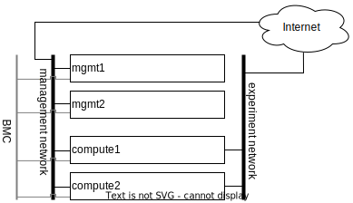
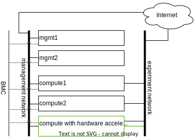
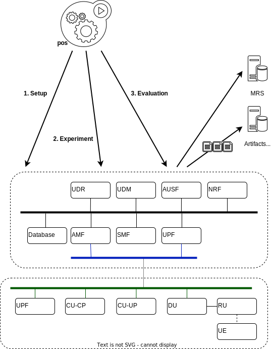

# 5G blueprint

5G has introduced the concept of modularization in its design. With this
ubiquitous modular architecture, 5G allows telco and IT worlds to meet and thus
outstanding innovations follow with the so-called post-5G propositions.

With all this, researchers have a wonderful object to experiments new ideas at
all the levels. Unfortunately, as every single detail count deploying a
full-fledged 5G remains a matter of specialists who have to choose the right
combination of software, hardware, and locations of the infrastructure. This may
divert researchers from their core research as they may have to invest
substantial amount of time and money just to setup their experimental platform.

The objective of this blueprint is to provide the community with a set of
**replicable software, hardware, and methodology to make experimental research
with cutting edge 5G environments**.

> [!NOTE]
> The first objective of this blueprint is to provide the right methodology to
> achieve reproducible experimental research in the field of 5G and beyond.

> [!NOTE]
> This document assumes that readers are familiar with 5G. Primer on 5G can be
> found in [[^5G]]. Reading the 3GPP TS 23.501 architecture is recommended
> [[^etsi]] for engineers willing to deploy this blueprint in their
> infrastructure.

In fact, this blueprint is designed in a modular way such that one can either
deploy it fully or only partially. For example, people only interested in 5G can
only deploy the core and use a simulated RAN, while people interested only in
the RAN can just deploy a RAN, assuming they have access to a core (e.g., via
the SLICES central node or another partner). Advanced users may even deploy a
core and connect it with multiple RANs. In addition, the blueprint describes a
workflow to achieve reproducible research.

This blueprint is built in increasing complexity, described step-by-step and
seconded by an open source reference implementation, that can be used as a
baseline:

* for researchers to exercise their experimental research;
* for the SLICES community to build the SLICES infrastructure.

First, the blueprint defines the minimal proposition where the entire
blueprint is deployed in one single local cluster. This option sets the
basis (software and hardware) for the blueprint. Second, it preposes a
case where the 5G core and 5G RAN are deployed in independent clusters. This
cases introduces additional constraints on the network and operations. Finally,
the RAN functions are divided according to split 7.2, which introduce strong
constraints on hardware features and operational deployment.

> [!IMPORTANT]
> Each step is built upon the previous one, it is then required to follow each
> of them in sequence.

## Single cluster

In this scenario, the minimum 5G and RAN is considered. All functions are
deployed in the same cluster of resources. This scenario defines the software
and hardware that are needed to run 5G-related experiments.

We can identify 3 groups of components.

### Control Components

The *AMF*, *AUSF*, *Database*, *NRF*, *SMF*, *UDM*, and *UDR* are essentially
control functions that are not expected to work at line rate even though they
may have to scale.

These functions are implemented in software.

For ease of resources management it is recommended to containerize them with
the `containerd` runtime [[^containerd]].

As soon as multiple compute resources (i.e., servers) are used to deploy the
functions it is preferable to rely on the `kubernetes` container orchestration
system [[^k8s]], than home-made tools.

#### Operating system
Linux is expected to be as the operating system supporting the environment, the
following distributions are recommended (they are proved to work well in all
deployments):

* Ubuntu Jammy LTS (22.04 LTS)
* Debian bookworm (stable 12)
* RHEL 9
* Rocky Blue Onyx (9.x)

Rocky Linux is proposed here as an alternative to RHEL when the RHEL commercial
licensing is not adequate.

Given the long term vision of the SLICES project, it is better to avoid using
older version of distributions, however the following version can be used 

* Ubuntu Focal LTS (20.04 LTS)
* Debian bullseye (oldstable 11)
* RHEL 8

Even though other Linux distributions could be used, our experience has shown
that CentOS, Fedora, and SUSE distributions may cause operational issues without
bringing significant advantages for the particular case of this blueprint.

#### Hardware

The operating system can be run directly on in-prem servers, with the following
constraints:

* CPUs have the `AMD64` architecture,
* CPUs support `Intel VT/AMD-V` virtualization hardware extensions,
* provide `IOMMU` capability,
* provisioning at least 4GB of RAM per core,
* dedicate at least 2 cores for the control and management of the server,
* dedicate the remaining cores to the experiments,
* have at least one NIC dedicated to management,
* have at least one NIC dedicated to experiments,
* have an out-of-band BMC (e.g., iDRAC, OpenBMC, iLO...),

The servers can be virtualized. The above mentioned requirements hold true for
the host and the guest but the following requirements are added:

* the server platform should support `SR-IOV`,
* SR-IOV to be activated on NICs dedicated to experiments,
* CPU over-provisioning to be avoided,
* inform clearly that the server is virtual.

If an hypervisor is used, virtualization extension must be exposed to the
virtual machines. The KVM virtualization module [[^kvm]] is recommended for its
large support and openness but other hypervisors can be considered. OpenStack
can be used to mange VMs.

It is recommended to use smartNICs for the management and the experiment
networks. The following NICs are good candidates:
* Intel E810
* NVIDIA Mellanox ConnectX-7
* NVIDIA Mellanox ConnectX-6

> [!IMPORTANT]
> It is essential to isolate management and experimental compute and networks.
> First to ensure that in any situation the operator can take back the hand on
> the server regardless of its state. Second to ensure that inherent operational
> actions (e.g., monitoring) have no impact on experiments (e.g., experimenters
> must only see traffic of their own).

If is possible to offload the functions to be hosted off-prem in public clouds.
This solution must be studied in a case by case. Amazon Web Services (AWS) and
Google Cloud Platform (GCP) have proven to be adequate.

> [!WARNING]
> Fork or commercial solutions built on top of the aforementioned tools can be
> used but care has to be taken regarding their long term availability, their
> compatibility with current best practices, and the absence of unadapted
> licensing or pricing.

The figure below represents a minimal cluster setup for operating this
blueprint.

All management tasks (e.g., SSH gateway, cluster management, DNS/DHCP, docker
registry, authentication) are offloaded in dedicated servers (`mgmt1` and
`mgmt2`). These two machines are configured to work in high availability mode,
one taking the load of the other should it be down.

These machines do never have load from experiments. For example if kubernetes is
used in the cluster, these machines will run the kubernetes control plane but
never run user pods.

The two other servers (`compute1` and `compute2`) are support the experiment
load (e.g., run the 5G functions).

An out-of-band network is put in use to connect the BMC of each server.

The *management network* is used to provision and control the servers. It does
not have particular performance requirements but 10Gbps is a good start to have
fast provisioning of the infrastructure.

The *experiment network* is for the exclusive use of experimenters where there
is only traffic generated by the experiments. High performance is expected for 
this network with at least 100Gbps per port.

> [!WARNING]
> The infrastructure should prevent single point of failure. This is the reason
> why management servers are redundant as the loss of the management would block
> the operation of the infrastructure. The networks should also be redundant. 

> [!NOTE]
> Given the high prices of switches and servers chassis it is not expected to
> have spare chassis sitting cold on a shelf (spare CPU, NICs, memory, HDD is
> expected though). Because shipping new such equipment may take time, it is
> essential to design the infrastructure such that the infrastructure can return
> back to its nominal operation in time much shorter than shipping time.

> [!TIP]
> The better, but costly option to make the network redundant is to double
> switches and NICs such that each server is connected to each redundant switch
> and activate LAG and MC-LAG. A cheaper option consists in splitting the
> network in two: half of the servers connected to one side, the other half to
> the other side. In case of failure of one switch, recabling machines on the
> down side of the network to the up side is enough to get back online. It
> does not prevent downtimes but it allows to keep them under reasonable bounds
> at low cost.

### User Plane Components

The *UPF* implements the user plane and is expected to work at line rate.

#### Software UPF
For low rates (< 1Gbps) the UPF can be deployed similarly to the functions
presented above.

For higher rates, the help of hardware accelerators is needed and the following
hardware should be considered:
* at least two CPU cores per UPF instance;
* CPU clock >= 3GHz;
* at least one smartNIC port per UPF instance.

Each instance of the UPF must have dedicated cores and NIC ports for offloading.
See linux kernel settings and DPDK for more details and compatibility
[[^cmdline], [^cpusets], [^dpdk]].

#### Hardware UPF
Hardware implementation of the UPF is also possible.

A in-network P4 implementation of the UPF is available for Tofino and Tofino 2
asics and is compatible with the following switches

* Edgecore Wedge100BF-32X,
* Edgecore Wedge100BF-32QS.

> [!NOTE]
> Given the uncertain availability and development of Tofino and P4 we recommend
> to consider P4 switches only if there is a specific objective of studying P4.

Instead of in-network hardware implementation of the UPF it is possible to have
server based hardware implementation. In this case, the server hosts specific
hardware boards (e.g., NVIDIA AX800, FPGA) where the UPF function is executed.
The server only plays the role of controlling the accelerator. This server can
be used to host functions of *group 1*.

##### Deployment considerations
The figure belows provides a proposition of deployment with hardware
accelerators.

Each accelerator port is connected to the experiment network. Specific
mechanisms must be put in place to allow configurable path from any port to any
port. The management of such paths must be invisible on the wire at the level of
compute nodes, for example using VLAN access ports or setting up match-action
rules on ports if the experiment network is implemented with SDN switches.

This architecture remains the same if the UPF is implemented directly on a P4
hardware switch. The switch appears in the infrastructure as a compute node with
advanced networking capabilities. Because changing P4 causes interruptions, the
P4 switches that are programmable to the users are not supposed to be used to
provide the experiment network connectivity itself. Each port of the switch must
be connected to the experiment network to emulate direct connectivity between
this switch and the other compute nodes.

It is possible to connect some accelerator ports directly to compute nodes to
have a subset of nodes with direct connectivity and remove extra latency that
would be caused by the experiment network.

> [!TIP]
> To offer more options to researchers using SLICES it is a good idea to provide
> multiple types of accelerators in the same infrastructure.

### Radio Components

The *gNB* and *UE* are the components that implement the RAN. They have specific
needs in terms of radio transmission such as specific hardware and frequency
licenses. They are also expected to operate at line rate and with bounded
latency.

Similarly to groups 1 and 2, the gNB and UE can be purely software. In this case
they have the same requirements as the functions in group 1. The gNB and UE are
implemented with Linux processes and the radio is simulated. However, in general
the link between the gNB and the UE is a radio channel. 

It means that the UE is a radio equipment. It is tempting to use smartphones but
they cause operational challenges. Smartphones need to be connected in USB to
a control machine that provides remote access with a graphical interface and
most smartphones do not provide access to low layers and have limited
configurability, preventing changing layer 1 or MAC behavior. For these reasons
it is better to use 5G modules (e.g., Quectel boards) that can easily be
instrumented and which have the ability to be programmed. Software define radios
can also be considered. Example of UEs that can be used are listed in [[^UE]].
It is not possible to have a lot of UEs in a testing facility. Multi-UE
emulators (e.g., from Amarisfot) are good options to test scenarios with lots
of UEs sharing the same spectrum.

As the gNB has a radio unit to serve the radio channel. The radio unit is
typically connected to a server, the radio treatment is executed in the radio
unit and the rest of the gNB functions on the server. Even though specific 5G
radio units can be use, using software-defined radios is a good option to test
custom PHY, MACs and various frequencies.

Below are good radio unit candidates to be installed in SLICES:

Software defined radio:
* Ettus USRP B210
* Ettus USRP X410
* Ettus USRP N320
* Ettus USRP N310
* Ettus USRP N300

Radio units:
* LiteOn Indoor (sub-6)LiteOn Outdoor (sub-6)
* VVDN (indoor sub-6)
* LiteOn Indoor (mmWave)
* LiteOn Outdoor (mmWave)
* AW2S sub-6 outdoor 2x2
* AW2S sub-6 outdoor 4x4

Some units are connected to their companion compute platform via USB and others
via network. The specificities of the deployment may have an impact on the
selected devices and the possibility to connect the server close to the radio
unit.

Radio units are low level devices, which firmware may have to be updated by
the experimenter. Also, they rarely provide out-of-band management services
(BMC). The infrastructure thus have to be designed such that they can be
controlled independently of the experiment and state.

In addition, it is often needed to be able to switch off radio units to avoid
them to pollute the spectrum of other units. In general they do not provide 
energy management API (i.e., no software solution to switch on or off the
device or go in sleep mode). To solve this issue managed power distribution
units (PDU) can be used.

Most devices are in AC and the usual managed PDUs (e.g., EATON EMAH28) are
perfectly adapted. However, it is not uncommon that RU operate in DC. In DC,
ethernet controlled multi channels DC relays should be used.

To monitor power consumption radio units can be linked to power meters. Most
managed PDUs offer this functionality. Chose power meters that offer read only
monitoring (e.g., via SNMP) to provide real time information to experimenters.

The figure below summarizes a deployment of radio equipment.

## Core / RAN separation

In this scenario, the core and the RAN networks are deployed using independent
clusters of resources.  Core and RAN separation correspond to two main
scenarios:
1. the core and the RAN are operated by the same partner by are deployed in
different facilities, e.g., the core is deployed in a datacenter and the RAN in
an anechoic chamber;
2. the core and the RAN are operated by different partners, e.g., one
specialized in core functionalities and the other in radio access.

This scenario highlights the need for strategies to ensure that parties can
interoperate. To interconnect the core and the RAN, it is necessary to use
specific network interconnections. Several challenges happen here. First the
cluster of resource becomes permeable to network exchanges from the outside
world. Second, a well-provisioned network connectivity must be establish to
carry the traffic between the clusters of resources.

In addition to technical point, policies have to be defined. One may notice that
we only consider one UPF and this UPF is in the core. This location has been
chosen to accentuate the need of careful definition of policies. Indeed, it is
expected that the UE gets Internet from the UPF, meaning that the operator of
the core network become an Internet Service Provider for third parties (i.e.,
the RAN network).

We discuss below three main options to interconnect clusters.

### Network
#### Dedicated links
It is possible to have dedicated Ethernet connectivity between the core and the
RAN clusters. One or several fibers are connected to the edge of each cluster,
the capacity should be at least 10Gbps but 2x25Gbps is more reasonable.

Each cluster has its own BMC and management networks. The experiment network
must appear as only one L2 entity. To provide isolation between the clusters
VLAN should be used.

#### Research network backbone
Sites and nodes in SLICES are usually connected to their national research and
education network (NREN). It is then possible to interconnect sites and nodes
via the global research network (nationally or internationally).

Each site provisions interconnection bandwidth with its NREN and VLANs to share
this bandwidth. VLANs between sites are interconnected by the NRENs on demand.
The global research and education network is seen as a blackbox. At least 1 Gbps
of bandwidth per interconnected cluster appears to be a strict minimum.

#### Public Internet
When dedicated links or NREN custom interconnection is not doable connectivity 
will use the public Internet. A VPN is established between the clusters. This
VPN should provide L2 connectivity, e.g., via VXLAN. When filtering does not
allow to setup direct tunnels between the cluster, a third party location can
be used (e.g., via a public cloud). 

### Resource orchestration

It is recommended to maintain one logical cluster per physical cluster to avoid
spreading resources management over multiple locations. This would add excessive
complexity (technical and administrative) with no significant benefits. To
allow experiments to combine multiple such independent clusters, some mechanism
must be provided. For kubernetes clusters Submariner is a valuable proposition
that provides direct L3 traffic exchanges between pods and services from
independent clusters [[^submariner]]. For specific cases, exposing interfaces 
to the pods with Multus [[^multus]] can be envisioned.

## RAN split

The general architecture of 5G introduced the ability to split the RAN in
different functional blocks. First, as shown in the figure below, gNB can be
divided in two main entities. The *Central Unit* (CU) and the *Distributed
Unit* (DU).

The CU encloses the higher layers that have less delay constraints than the
lower layers components that are implemented in the DU because they need to be
located close to the radio units because of short control loop. As a result,
DU are typically distributed all over the operator infrastructure, each DU being
in charge of a cell or a few cells, while the CU is located in regional
locations and in charge of multiple DU.

To make the usage of resources even better, the CU can be split in CU-CP
and CU-UP where the former handles all functions related to the control plane
which have lower requirements in terms of bandwidth. The latter is in charge of
handling all user plane functions.

The figure below, extracted from [[^5G]] shows the details of the division. The
split is commonly named as O-RAN Fronthaul Spilt Option 7-2x.
![RAN split processing (figure from [[^5G]])](images/split_5g_system_approach.png)

Most of the PHY is handled at the *Radio Unit* (RU) while the upper part of the
PHY and the MAC are executed at the DU. This means that high speed-low-letency
stable links must be used to connect the RU to the DU. Actually to guarantee
proper execution, time synchronization is necessary. This has an important
impact on the infrastructure hosting the RAN.

First, low latency switches must be used to interconnect elements (direct links
should be avoided as they are not flexible enough and the approach would not
scale) and these switches need to support time synchronization via PTP [[^ptp]]
and the support of a PTP grandmaster clock throughout the RAN' cabled
infrastructure.

Second, the network infrastructure must be compliant with the CPRI standard
that defines a transport interface between cell sites and base stations.

The following switches are recommended:
* Cisco Nexus 93180YC-FX3;
* Cisco Nexus 9364C-GX.

An alternative using **Fibrolan Falcon-RX/812/G/A** can also be considered if
the infrastructure remains small (a few RU).

Moreover, offering a PTP grandmaster clocks in the infrastructure has a impact
on the location where the hardware can be deployed as it requires acquisition of
GNSS. The signal acquisition mechanism must be carefully chosen based on the
physical constraints of the hosting environment (e.g., some radio chambers only
allow fiber as they do not allow to pass a coaxial cable from the outside of the
room as they would become wave guides).

Finally, splitting the RAN and implementing it in software adds more constraints
on the servers processing the signals, the server must:

* have at least 12 dedicated cores per CPU;
* run at a frequency > 3GHz;
* multiple memory channels;
* support the AVX-512 instruction extension;
* one smartNIC port per RU line (typically 2 lines per RU);
* smartNICs to support SR-IOV.

To achieve high performance, real-time Linux kernel must be used.

The LiteOn and AW2S radio unit listed in [group 3](5g_blueprint.md#group-3) are
good candidates to implement the RAN split.

> [!TIP]
> We recommend to read O-RAN documentation [[^oran]] to have a good
> understanding of the many technical constraints imposed but split 7.2.

## Research methodology

As extensively discussed in the
[reproducibility chapter](README.md#reproducible-research) of the blueprint,
experiments follow cycles that can be decomposed in three cycles[[^pos]]:

* the **setup phase** where resources are provisioned and configured;

* the **measurement/experiment phase** where the experiment actually happens;

* the **evaluation phase** where results are extracted, analyzed, and archived
for subsequent analysis and validation.

SLICES aims to offer reproducible by design. Three main components are necessary
to support it.

### Experiment orchestrator

Experiments imply provisioning of resources, synchronization of tasks,
exploration of parameter sets, tracking of infrastructure state, data
collection, and full documentation. To guarantee reproducibility and sound
methodology all these tasks must be automated and then can be managed by the pos
framework [[^pos]].

One the one hand, pos provides a backend to manage resources and control tasks.
On the other hand, pos offers an interface to describe experiments. The
different experiment steps (e.g., different Ansible playbook runs) are defined
in pos that is in charge of orchestrating the different actions, explore the
parameters set, handle error and organize experiment results. Evaluation of 
the experiment can then be accomplished without ambiguity.

Using a framework like pos removes manual operations during experiments and
tracks all actions that may have impacted the experimentation.

In this blueprint, the setup phase consists in creating a core and a RAN
network, to interconnect them and once the UE is connected to the gNB measure
the delay to the UPF. This cycle must be repeated for deployment scenarios of
group 1, group 2, and group 3. Ultimately the experiment is the same (i.e.,
measure the delay) but the different steps vary largely. This is where pos
helps quite a lot as if the experiment is the same, the parameters of deployment
are different and it takes care of dealing with the infrastructure adequately
for each parameter and execute the measurement.

### Artifacts repository

Experiments generate three different types of data:

* experiment workflow: the different steps that have been executed from start to
end of the experiment;
* experiment results: artifacts generated by the experiment
itself (e.g., computation results, measured data, software logs but also
all software created and used to run the experiment);
* infrastructure state: the state of each component of the infrastructure.

The experiment workflow is essentially the pos execution script and is needed
for researchers to understand how results have been obtained. The results of the
experiments are all data directly generated by the experiment (what researchers
usually use in their evaluation). Finally the infrastructure state is a snapshot
of the status of the infrastructure at the moment of the experiment.
All the data put together compose the artifacts of the experiments.

It is out of the scope of this blueprint to provide information on how to setup
and operate artifact repository. However, every artifact must be stored for
evaluation and validation purpose in a long term storage in an non-fungible way,
without ambiguity. Pos ensures the publication of all artifacts. Artifacts can 
be publicly available or not. See
[reproducibility chapter](README.md#reproducible-research) of the blueprint for
more details.

### Metadata registry

Experiments are the results of complex interactions components. Each such
component must be uniquely identified (e.g., dataset, service,
hardware...) such that its evolution can be tracked throughout its lifecycle
(e.g., configuration, value...) and utilization conditions (e.g., access rights,
licensing, pricing) well defined.

In SLICES everything is abstracted in digital objects and metadata are tracked
in the Metadata Registry System (MRS).

The definition of the MRS is out the scope of this blueprint. But every artifact
generated in SLICES must see its associated metadata published in the MRS. Pos
ensures the publication of metadata for experiments but changes not resulting
from experiments shall also be published in the MRS.

For full flexibility and to ease sharing between researchers, the MRS provides a
search engine. In addition to providing syntaxic search, the MRS query engine
provides semantic search.

## Reference implementation

Companion reference implementation of this blueprint can be found at 

* https://github.com/dsaucez/SLICES.git
* https://moocs-academy.slices-ri.eu/course/view.php?id=6
* https://doc.slices-sc.eu/blueprint/
* https://github.com/Xymanek/slices-mrs-deployment
* https://gitlab.lrz.de/I8-testbeds/wiki

A demonstration of the full experimental cycle with publication of artifacts
and metadata in the MRS can be seen at https://youtu.be/PD4bz9Tktf0.

## References
[^5G]: Peterson, L., Sunay, O., Davie, B., 2023. Private 5G: A Systems Approach, https://5g.systemsapproach.org/, accessed December 12, 2023.
[^etsi]: ETSI, T., 123 501 V16. 6.0 (Oct. 2020). System architecture for the 5G System (5GS)
(3GPP TS 23.501 version 16.6.0 Release 16), https://www.etsi.org/deliver/etsi_ts/123500_123599/123501/16.06.00_60/ts_123501v160600p.pdf, accessed December 12, 2023.
[^containerd]: https://containerd.io/, accessed December 12, 2023.
[^k8s]: https://kubernetes.io/, accessed December 12, 2023.
[^kvm]: https://linux-kvm.org/page/Main_Page, accessed December 12, 2023.
[^cpusets]: https://docs.kernel.org/admin-guide/cgroup-v1/cpusets.html, accessed December 12, 2023.
[^cmdline]: https://www.kernel.org/doc/html/latest/admin-guide/kernel-parameters.html, accessed December 12, 2023.
[^taskset]: https://man7.org/linux/man-pages/man1/taskset.1.html, accessed December 12, 2023.
[^dpdk]: https://core.dpdk.org/supported/, accessed December 12, 2023.
[^oran]: https://docs.o-ran-sc.org/projects/o-ran-sc-o-du-phy/en/latest/Introduction_fh.html, accessed December 12, 2023.
[^ptp]:  "1588-2019 - IEEE Approved Draft Standard for a Precision Clock Synchronization Protocol for Networked Measurement and Control Systems". IEEE., accessed December 12, 2023.
[^UE]: List of COTS UEs Tested with OAI, https://gitlab.eurecom.fr/oai/cn5g/oai-cn5g-fed/-/blob/master/docs/LIST_OF_TESTED_COTSUE.md, accessed December 12, 2023.
[^submariner]: https://submariner.io/, accessed December 12, 2023.
[^multus]: https://github.com/k8snetworkplumbingwg/multus-cni, accessed December 12, 2023.
[^pos]: Gallenmüller, S., Scholz, D., Stubbe, H. and Carle, G., 2021, December. The pos framework: A methodology and toolchain for reproducible network experiments. In Proceedings of the 17th International Conference on emerging Networking EXperiments and Technologies (pp. 259-266).
